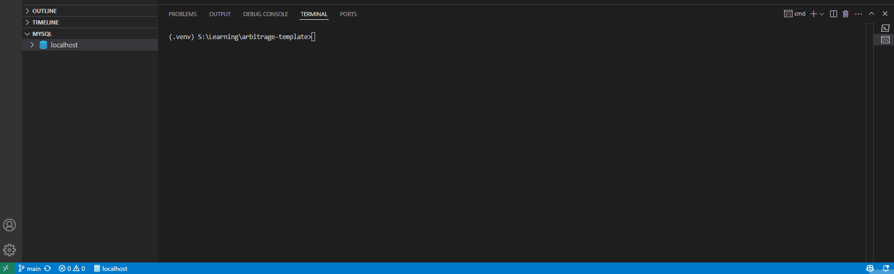

# Arbitrage Detection Tool

[](https://github.com/blueskycircle/arbitrage-template/actions/workflows/main.yml)

A comprehensive template tool for finding arbitrage opportunities between Amazon and static input (which can be swapped out). This project scrapes product data, stores it in a database, and analyzes price differences to identify potential profit opportunities.

## Table of Contents
- [Overview](#-overview)
- [Installation](#-installation)
  - [Prerequisites](#prerequisites)
  - [Setup](#setup)
- [Database Schema](#-database-schema)
- [Command-Line Interface (CLI)](#-command-line-interface-cli)
  - [Command: init](#command-init)
  - [Command: scrape](#command-scrape)
  - [Command: detect](#command-detect)
  - [Command: find](#command-find)
  - [Command: history](#command-history)
  - [Output Formats](#output-formats)
- [REST API](#-rest-api)
  - [Starting the API Server](#starting-the-api-server)
  - [API Endpoints](#api-endpoints)
    - [Product Scraping](#product-scraping)
    - [Finding Opportunities](#finding-opportunities)
    - [Retrieving Opportunities](#retrieving-opportunities)
    - [Managing Snapshots](#managing-snapshots)
    - [Retrieving Items](#retrieving-items)
- [Project Structure](#-project-structure)

## Overview

This tool helps you identify price differences between products on Amazon and other sources, allowing you to find arbitrage opportunities. Key features:

- **Multi-source product scraping**: Amazon product scraping with custom product naming support
- **Comprehensive data storage**: Save products, snapshots, and opportunities to a database
- **Flexible opportunity detection**: Configure minimum profit thresholds and filtering options
- **Historical tracking**: Monitor price changes and opportunities over time
- **Multiple output formats**: Table, text, and CSV output options
- **CLI and API interfaces**: Command-line tool and REST API access

## Installation

### Prerequisites

- Python 3.11+
- MySQL

### Setup

1. **Clone the repository**
   ```bash
   git clone https://github.com/yourusername/arbitrage-template.git
   cd arbitrage-template
   ```

2. **Create a virtual environment**
   ```bash
   python -m venv venv
   source venv/bin/activate  # On Windows: venv\Scripts\activate
   ```

3. **Install dependencies**
   ```bash
   pip install -r requirements.txt
   ```

4. **Configure the database**
   
   Create a `.env` file in the project root directory with the following variables:
   ```
   DB_HOST=localhost
   DB_PORT=3306
   DB_NAME=arbitrage
   DB_USER=username
   DB_PASSWORD=password
   ```

5. **Initialize the database**
   ```bash
   python cli.py init
   ```

## Database Schema

The application uses a relational database with the following key tables:

- **Snapshots**: Point-in-time collections of product data
- **Items**: Individual product data with source, name, price, and URL
- **Opportunities**: Detected arbitrage opportunities with buy/sell details

## Command-Line Interface (CLI)

The tool provides a comprehensive CLI with five main commands:

```bash
python cli.py init      # Initialize the database
python cli.py scrape    # Collect product data
python cli.py detect    # Find arbitrage opportunities
python cli.py find      # Find and save arbitrage opportunities to database
python cli.py history   # View historical arbitrage opportunities
```

### Command: init



Initializes the database with required tables.

```bash
python cli.py init
```

### Command: scrape


Collects product data from Amazon and/or static sources.

```bash
# Basic usage
python cli.py scrape -a "https://www.amazon.co.uk/dp/B0DGJ746HN?th=1"

# Options:
# -a, --amazon-url: Amazon product URL (can specify multiple)
# -n, --amazon-name: Custom name for the product (must match order of URLs)
# --static/--no-static: Include/exclude static data
# --snapshot-name: Custom name for the database snapshot
```

Examples:
```bash
# Scrape with custom product names
python cli.py scrape -a "https://www.amazon.co.uk/dp/B0DGJ746HN?th=1" -n "iPhone 16 256GB"

# Include static demo products
python cli.py scrape -a "https://www.amazon.co.uk/dp/B0DGJ746HN?th=1" -n "iPhone 16 256GB" --static

# Create a named snapshot
python cli.py scrape -a "https://www.amazon.co.uk/dp/B0DGJ746HN?th=1" --snapshot-name "Morning prices"

# Scrape multiple products with custom names and create named snapshot
python cli.py scrape -a "https://www.amazon.co.uk/dp/B0DGJ746HN?th=1" -a "https://www.amazon.co.uk/dp/B0DGHV5FF8?th=1" -n "iPhone 16 256GB" -n "iPhone 16 128GB" --static --snapshot-name "CLI iPhone Comparison"
```

### Command: detect


Analyzes product data to find arbitrage opportunities.

```bash
# Basic usage
python cli.py detect -a "https://www.amazon.co.uk/dp/B0DGJ746HN?th=1"

# Options:
# -a, --amazon-url: Amazon product URL (can specify multiple)
# -n, --amazon-name: Custom name for the product
# --static/--no-static: Include/exclude static data
# -s, --snapshot-id: Use products from specific snapshot
# -l, --latest: Use products from latest snapshot
# -p, --min-profit: Minimum profit percentage (default: 5.0%)
# -f, --format: Output format (table, text, csv)
# -o, --output: Save results to file
```

Examples:
```bash
# Use data from latest snapshot
python cli.py detect --latest

# Specify minimum profit and save to CSV
python cli.py detect -a "https://www.amazon.co.uk/dp/B0DGJ746HN?th=1" -p 10.0 -f csv -o opportunities.csv
```

### Command: find


Similar to detect but automatically saves opportunities to the database.

```bash
# Basic usage
python cli.py find -a "https://www.amazon.co.uk/dp/B0DGJ746HN?th=1"

# Options:
# Same as 'detect', plus:
# --save/--no-save: Save to database or not (default: save)
```

Examples:
```bash
# Find and save opportunities
python cli.py find -a "https://www.amazon.co.uk/dp/B0DGJ746HN?th=1" -n "iPhone 16 256GB"

# Find opportunities without saving
python cli.py find --latest --no-save
```

### Command: history


View historical arbitrage opportunities from the database.

```bash
# Basic usage
python cli.py history

# Options:
# -s, --snapshot-id: Show opportunities from specific snapshot
# -l, --latest: Show opportunities from latest snapshot
# -d, --days: Show opportunities from last N days (default: 7)
# -p, --min-profit-percent: Filter by minimum profit percentage
# -a, --min-profit-amount: Filter by minimum profit amount
# --limit: Maximum number of results (default: 50)
# -f, --format-type: Output format (table, text, csv)
# -o, --output: Save results to file
```

Examples:
```bash
# View opportunities from latest snapshot
python cli.py history --latest

# Filter by profit percentage
python cli.py history --min-profit-percent 10

# Export to CSV
python cli.py history --days 30 -f csv -o history.csv
```

### Output Formats

All commands support three output formats:

- **Table** (default): Formatted grid display
- **Text**: Simple text output with numbered items
- **CSV**: Comma-separated values for spreadsheet import

Specify format with the `-f` option:
```bash
python cli.py detect --latest -f csv -o results.csv
```

## REST API

The project also includes a FastAPI-based REST API that provides the same functionality through HTTP endpoints.


### Starting the API Server

```bash
# Start the API server
uvicorn api.main:app --reload
```

Once running, access the interactive API documentation at: http://localhost:8000/docs

### API Endpoints

#### Product Scraping

```
POST /scrape
```

Request body:
```json
{
  "amazon_urls": ["https://www.amazon.co.uk/dp/B0DGJ746HN?th=1"],
  "amazon_names": ["iPhone 16 256GB"],
  "include_static": true,
  "snapshot_name": "API Test"
}
```

Curl example (Command Prompt):
```cmd
curl -X POST ^
  http://localhost:8000/scrape ^
  -H "Content-Type: application/json" ^
  -d "{\"amazon_urls\": [\"https://www.amazon.co.uk/dp/B0DGJ746HN?th=1\"], \"amazon_names\": [\"iPhone 16 256GB\"], \"include_static\": true, \"snapshot_name\": \"API Test\"}"
```

#### Finding Opportunities

```
POST /detect
```

Request body:
```json
{
  "snapshot_id": null,
  "use_latest": true,
  "min_profit_percent": 5.0
}
```

Curl example (Command Prompt):
```cmd
curl -X POST ^
  http://localhost:8000/detect ^
  -H "Content-Type: application/json" ^
  -d "{\"use_latest\": true, \"min_profit_percent\": 7.5, \"min_profit_amount\": 10.0, \"limit\": 20}"
```

#### Retrieving Opportunities

```
GET /opportunities?latest=true&min_profit_percent=5
```

Parameters:
- `snapshot_id`: Optional specific snapshot ID
- `latest`: Use latest snapshot (boolean)
- `days`: Number of days to look back
- `min_profit_percent`: Minimum profit percentage
- `min_profit_amount`: Minimum profit amount
- `limit`: Maximum results to return

Curl examples (Command Prompt):
```cmd
:: Get opportunities from latest snapshot
curl -X GET "http://localhost:8000/opportunities?latest=true&min_profit_percent=5"

:: Get opportunities from specific snapshot
curl -X GET "http://localhost:8000/opportunities?snapshot_id=abcd1234&min_profit_percent=10"

:: Get opportunities from the last 3 days with minimum profit amount
curl -X GET "http://localhost:8000/opportunities?days=3&min_profit_amount=15&limit=100"
```

#### Managing Snapshots

```
GET /snapshots
GET /snapshots/{snapshot_id}
```

Curl examples (Command Prompt):
```cmd
:: List all snapshots (most recent first)
curl -X GET "http://localhost:8000/snapshots?limit=5"

:: Get details for a specific snapshot
curl -X GET "http://localhost:8000/snapshots/abcd1234"
```

#### Retrieving Items

```
GET /items?snapshot_id={snapshot_id}&source=amazon
```

Parameters:
- `snapshot_id`: Optional specific snapshot ID
- `source`: Filter by source (amazon, static, etc.)
- `limit`: Maximum results to return

Curl examples (Command Prompt):
```cmd
:: Get items from latest snapshot
curl -X GET "http://localhost:8000/items"

:: Get items from specific snapshot, filtered by source
curl -X GET "http://localhost:8000/items?snapshot_id=abcd1234&source=amazon&limit=50"

:: Get static items only
curl -X GET "http://localhost:8000/items?source=static"
```

## Project Structure

```
.
├── api/                  # REST API implementation
│   ├── main.py           # API endpoints
│   └── models.py         # API data models
├── core/                 # Core application logic
│   ├── arbitrage/        # Arbitrage detection logic
│   │   └── detector.py   # Opportunity detection algorithm
│   ├── database/         # Database operations
│   │   ├── models.py     # SQLAlchemy data models
│   │   └── operations.py # Database CRUD operations
│   └── scrapers/         # Product data scrapers
│       ├── web_scraper_base.py   # Base scraper functionality
│       └── websites/             # Website-specific scrapers
│           ├── amazon_scraper.py # Amazon product scraper
│           └── static_scraper.py # Static data scraper
├── cli.py                # Command-line interface
├── config/               # Configuration management
│   └── settings.py       # Application settings
├── requirements.txt      # Project dependencies
└── README.md             # Project documentation
```

